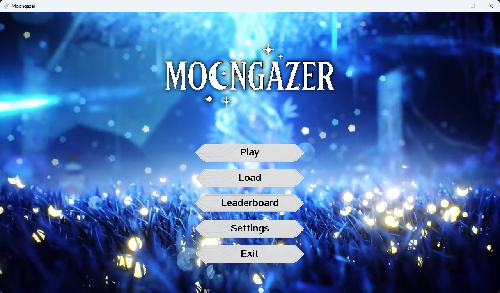
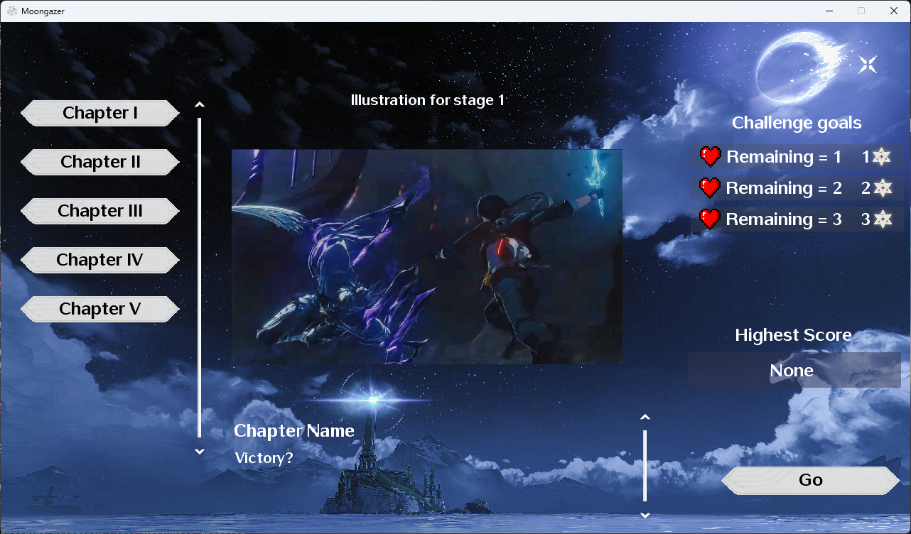
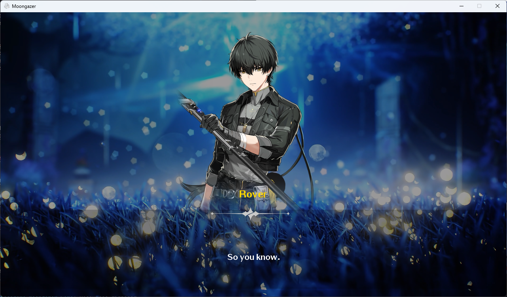
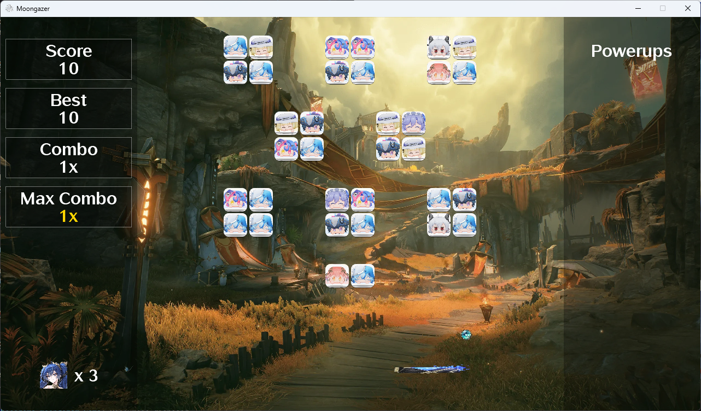
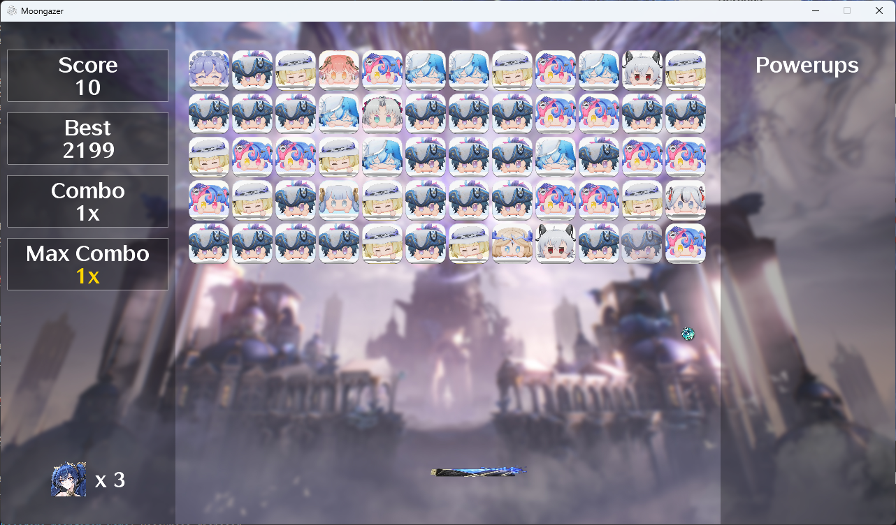
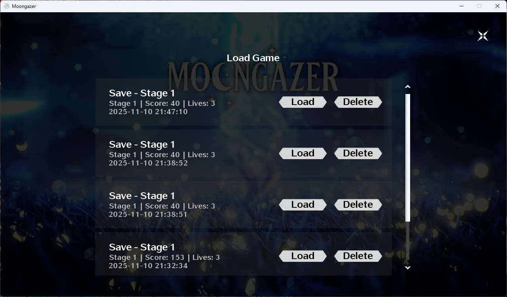
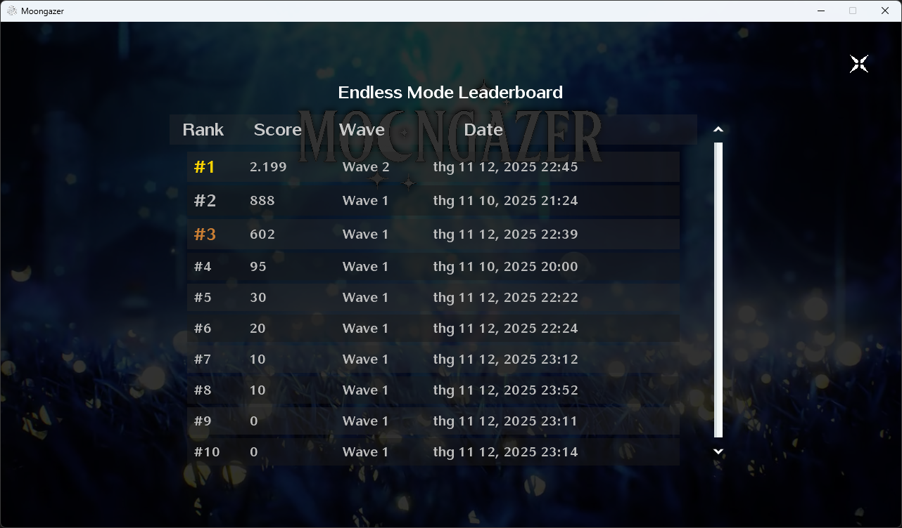

# Moongazer - Story-Driven Arkanoid Game

## Author
Group vibEcoderS - Class INT2204 6
1. Nguyễn Thế Hưng - 24020150
2. Nguyễn Quốc Khánh - 24022671
3. Phạm Quang Minh - 24020239
4. Nguyễn Gia Quang - 24020619

**Instructor**: Kiều Văn Tuyên
**Semester**: HK1 2025-2026

---

## Description
Moongazer is a story-driven Arkanoid game that combines classic brick-breaking gameplay with visual novel storytelling elements. Set in the world of Wuthering Waves, players experience an engaging narrative while enjoying challenging Arkanoid mechanics.

**Key features:**
1. **Dual Game Modes**: Story Mode with narrative chapters and Endless Mode for infinite gameplay
2. **Visual Novel Integration**: Fully voiced story scenes with character dialogues
3. **Modern Tech Stack**: Built with Java 25 and LibGDX framework
4. **Comprehensive Save System**: Multiple save slots with progress tracking
5. **Rich Visual Effects**: Parallax backgrounds, combo animations, and smooth transitions
6. **Database-Driven**: SQLite database for high scores, saves, and leaderboards
7. **Professional UI**: Wuthering Waves-inspired interface with custom fonts and assets

**Game mechanics:**
- Control a paddle to bounce balls and destroy bricks
- Collect power-ups for enhanced abilities (Expand Paddle, Multi Ball, Laser Gun, etc.)
- Progress through 5 story chapters with unique narratives
- Compete in Endless Mode with increasing difficulty waves
- Track high scores for each stage and endless mode
- Experience smooth parallax effects and dynamic visuals

---

## UML Diagram


---

## Design Patterns Implementation

### 1. Scene Management Pattern
**Used in:** `Game` class and all Scene implementations

**Purpose:** Manages game states and transitions between different scenes (Main Menu, Story Mode, Endless Mode, etc.)

### 2. Factory Pattern
**Used in:** Brick creation system

**Purpose:** Creates different types of bricks (breakable, unbreakable, power-up bricks) with various durability levels

### 3. Observer Pattern
**Used in:** UI callbacks and game event handling

**Purpose:** Handles button clicks, menu actions, and game state changes through callback systems

### 4. Strategy Pattern
**Used in:** Different game modes (Story vs Endless)

**Purpose:** Different scoring, progression, and win/lose conditions for each game mode

---

## Multithreading Implementation

The game uses multiple threads to ensure smooth performance:

1. **Main Game Thread**: LibGDX's application thread handles the game loop at 60 FPS
2. **Asset Loading Thread**: Asynchronous loading of audio files and resources
3. **Audio Playback**: Background music and sound effects play on separate threads
4. **Database I/O Thread**: SQLite operations for saves and high scores run asynchronously
5. **Video Playback**: Background video in main menu runs on dedicated thread

---

## Installation

### Prerequisites
- Java 25 or higher
- Gradle 9.0+ (included via wrapper)

### Steps
1. Clone the repository:
   ```bash
   git clone https://github.com/teppyboy/Moongazer.git
   cd Moongazer
   ```

2. Build the project:
   ```bash
   ./gradlew build
   ```

3. Run the game:
   ```bash
   ./gradlew run
   ```

---

## Usage

### Controls
| Key             | Action                     |
| --------------- | -------------------------- |
| `←` (Changable) | Move paddle left           |
| `→` (Changable) | Move paddle right          |
| `SPACE`         | Launch ball / Shoot bullet |
| `ESC`           | Pause game / Go back       |
| `Mouse Click`   | UI interactions            |


### Game Modes

#### Story Mode
1. Select **Story Mode** from the main menu
2. Choose from 5 chapters (Victory?, Echoes of Oblivion, The Realm of Chaos, Fate Rewritten, A New Beginning)
3. Experience visual novel scenes between gameplay
4. Complete objectives to progress through the story
5. Save your progress at any time
6. Track high scores for each chapter

#### Endless Mode
1. Select **Endless Mode** from the main menu
2. Survive through infinite waves of bricks
3. Difficulty increases with each wave
4. Compete for the highest score on the leaderboard
5. Track your best wave and score

### Power-ups
| Power-up      | Effect                                      | Duration   |
| ------------- | ------------------------------------------- | ---------- |
| Expand Paddle | Increases paddle width                      | 10 seconds |
| Extra Life    | Grants an additional life                   | Permanent  |
| Fast Ball     | Increases ball speed by 100%                | Temporary  |
| Slow Ball     | Decreases ball speed by 50%                 | Temporary  |
| Multi Ball    | Spawns 2 additional balls                   | Permanent  |
| Super Ball    | Ball passes through bricks without bouncing | 15 seconds |
| Laser Gun     | Shoot lasers to destroy bricks              | 12 seconds |
| Explosive     | Destroys nearby bricks on impact            | Instant    |

### Special Features

#### Combo System
- Hit bricks consecutively without missing to build combo multiplier
- Visual feedback with Iuno character appearance at 10x, 20x, 30x combos
- Combo resets when ball is missed

#### Save/Load System
- **Story Mode**: Save progress at any time during gameplay
- **Multiple Slots**: Support for 3 separate save slots
- **Auto-save**: High scores are automatically saved
- **Load Game**: Resume from last checkpoint

---

## Demo

### Screenshots

**Main Menu with Parallax Effect**  


**Story Mode Selection**  


**Visual Novel Scene**  


**Gameplay with Combo System**  


**Endless Mode**  


**Save/Load System**  


**Leaderboard**  


### Video Demo
[Video Demo Coming Soon]

*Gameplay videos will be available in `docs/demo/` folder*

---

## Project Structure

```
Moongazer/
├── app/
│   ├── src/
│   │   ├── main/
│   │   │   ├── java/org/vibecoders/moongazer/
│   │   │   │   ├── arkanoid/          # Core game objects
│   │   │   │   ├── dialogue/          # Visual novel system
│   │   │   │   ├── managers/          # Asset & Audio managers
│   │   │   │   ├── scenes/            # Game scenes
│   │   │   │   │   ├── arkanoid/      # Arkanoid gameplay
│   │   │   │   │   └── story/         # Story stages
│   │   │   │   ├── ui/                # UI components
│   │   │   │   ├── Game.java          # Main game class
│   │   │   │   └── SaveGameManager.java # Database management
│   │   │   └── resources/
│   │   │       ├── textures/          # Game sprites
│   │   │       ├── audio/             # Music & SFX
│   │   │       ├── videos/            # Background videos
│   │   │       └── fonts/             # UI fonts
│   │   └── test/                      # Unit tests
│   └── build.gradle.kts               # Build configuration
├── docs/                              # Documentation
└── README.md
```

---

## Technologies Used

| Technology      | Version         | Purpose             |
| --------------- | --------------- | ------------------- |
| Java            | 25              | Core language       |
| LibGDX          | 1.13.0          | Game framework      |
| Gradle          | 9.0.0           | Build tool          |
| SQLite          | 3.46.1.0        | Database (via JDBC) |
| SLF4J + Logback | 2.0.16 / 1.5.12 | Logging             |
| JUnit Jupiter   | 5.11.3          | Unit testing        |
| gdx-video       | 1.3.3           | Video playback      |

---

## Testing

The project includes comprehensive unit tests for core game mechanics:

```bash
# Run all tests
./gradlew test

# Run specific test class
./gradlew test --tests "org.vibecoders.moongazer.arkanoid.BallTest"
```

**Test Coverage:**
- Ball mechanics (velocity, launch, combo, properties)
- Brick system (durability, power-ups, destruction)
- Paddle movement and controls
- Bullet mechanics

---

## Future Improvements

### Planned Features
1. **Enhanced Story Mode**
    - Additional chapters and story branches
    - Multiple endings based on player choices
    - More character interactions and voiced dialogues

2. **Gameplay Enhancements**
    - More power-up varieties (Shield, Time Slow, Magnet, etc.)
    - Boss battles with unique mechanics
    - Challenge mode with special objectives
    - Co-op multiplayer support

3. **Technical Improvements**
    - Achievement system with rewards
    - Cloud save synchronization
    - Steam integration for leaderboards
    - Mobile version (Android/iOS)
    - Modding support for custom stages

4. **Visual & Audio**
    - More particle effects and animations
    - Additional background music tracks
    - Customizable themes and skins
    - Replay system for recording gameplay

---

## Known Issues

- None currently reported

*Please report any bugs or issues on the GitHub Issues page*

---

## Technologies Used

Main technologies

| Technology  | Version  | Purpose                  |
| ----------- | -------- | ------------------------ |
| Java        | 25+      | Core language            |
| libGDX      | 1.13.5   | GUI framework            |
| Gradle      | 9.0.0    | Build tool               |
| JUnit       | latest   | Testing framework        |
| sqlite-jdbc | 3.47.1.0 | Stores user data locally |
---

For all dependencies please referer to [build.gradle.kts](./app/build.gradle.kts) file.

## License

This project is developed for educational purposes only.

**Academic Integrity:** This code is provided as a reference. Please follow your institution's academic integrity policies.

**Asset Attribution:**
- Character sprites and UI elements are inspired by Wuthering Waves (Kuro Games)
- Background music tracks are from various sources
- Some sound effects are from royalty-free libraries
- All assets are used for educational purposes under fair use

---

## Acknowledgments

- **Instructor**: Kiều Văn Tuyên for guidance and support
- **Kuro Games**: For inspiration from Wuthering Waves
- **LibGDX Community**: For excellent documentation and support
- **Group Members**: For vibe coding and collaborative effort

---

## Contact

For questions or feedback about this project:
- GitHub: [teppyboy/Moongazer](https://github.com/teppyboy/Moongazer)
- Group: vibEcoderS

---

## Notes

- The game was developed as part of the Object-Oriented Programming with Java course curriculum
- All code is written by group members with guidance from the instructor
- Project demonstrates practical application of OOP principles, design patterns, and modern Java development
- Assets are used for educational purposes only

---

*Last updated: November 12, 2025*

